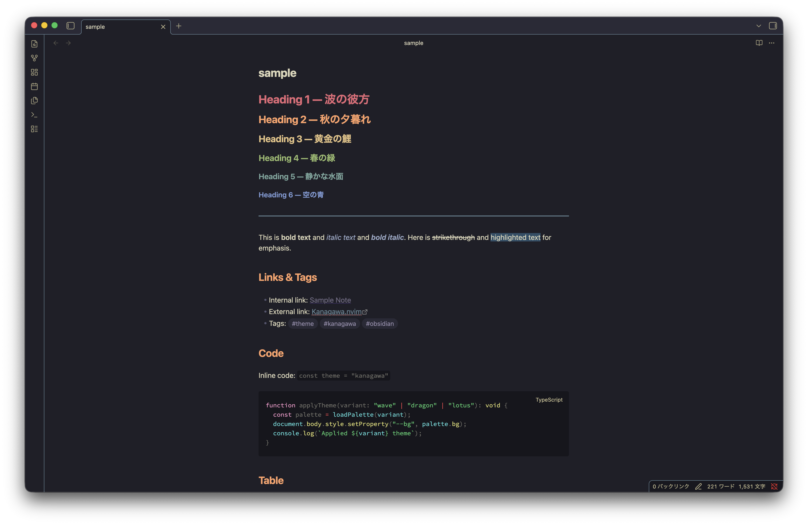
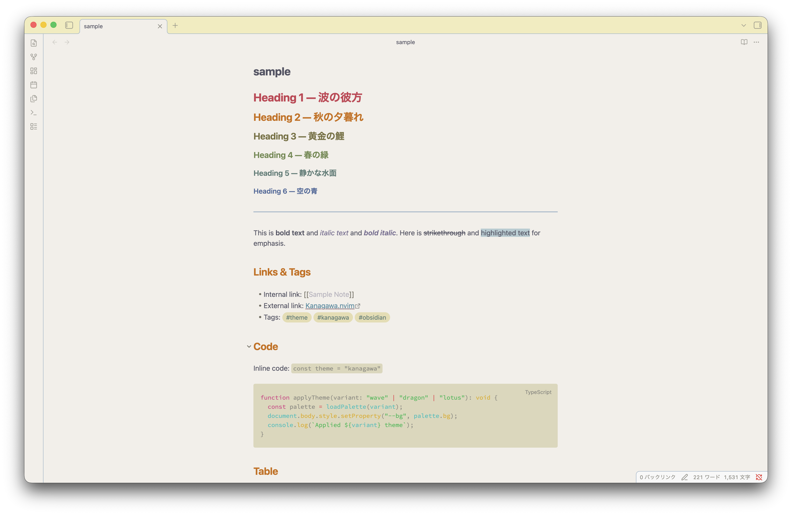

# Kanagawa for Obsidian

An [Obsidian](https://obsidian.md/) theme inspired by the colors of the famous painting by Katsushika Hokusai — [The Great Wave off Kanagawa](https://en.wikipedia.org/wiki/The_Great_Wave_off_Kanagawa).

Color palette is based on [kanagawa.nvim](https://github.com/rebelot/kanagawa.nvim).

## Variants

| Variant    | Mode       | Description                                                                                             |
| ---------- | ---------- | ------------------------------------------------------------------------------------------------------- |
| **Wave**   | Dark       | Default dark theme with deep ocean tones                                                                |
| **Dragon** | Dark (alt) | Muted, warm dark theme (requires [Style Settings](https://github.com/mgmeyers/obsidian-style-settings)) |
| **Lotus**  | Light      | Warm paper-like light theme                                                                             |

## Installation

### From Community Themes

1. Open Obsidian **Settings** → **Appearance** → **Themes**
2. Click **Manage** and search for "Kanagawa"
3. Click **Install and use**

### Manual

1. Download `theme.css` and `manifest.json` from the [latest release](https://github.com/kmkkiii/kanagawa/releases/latest)
2. Create a folder `Kanagawa` in `<vault>/.obsidian/themes/`
3. Place both files inside the folder
4. Open Obsidian **Settings** → **Appearance** → **Themes** and select **Kanagawa**

## Style Settings

Install the [Style Settings](https://github.com/mgmeyers/obsidian-style-settings) plugin for additional options:

- **Dark theme variant** — Switch between Wave and Dragon
- **Text font** — Custom text font family
- **Monospace font** — Custom monospace font family

## Background

This theme was created because the original Obsidian Kanagawa theme ([obsidian_kanagawa](https://github.com/sspaeti/obsidian_kanagawa) by [@sspaeti](https://github.com/sspaeti)) is no longer available (repository returned 404). This is a fresh rewrite based on the same [kanagawa.nvim](https://github.com/rebelot/kanagawa.nvim) color palette, with modernized CSS and additional Dragon variant support.

## Credits

- Color palette: [kanagawa.nvim](https://github.com/rebelot/kanagawa.nvim) by [@rebelot](https://github.com/rebelot) (MIT License)
- Original Obsidian port: [obsidian_kanagawa](https://github.com/sspaeti/obsidian_kanagawa) by [@sspaeti](https://github.com/sspaeti)

## License

[MIT](LICENSE)

The color palette used in this theme is derived from [kanagawa.nvim](https://github.com/rebelot/kanagawa.nvim), which is licensed under the MIT License. See the original [LICENSE](https://github.com/rebelot/kanagawa.nvim/blob/master/LICENSE) for details.
